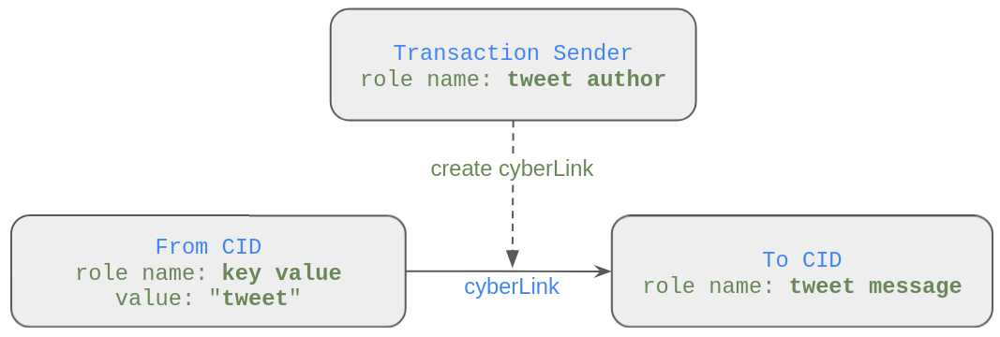
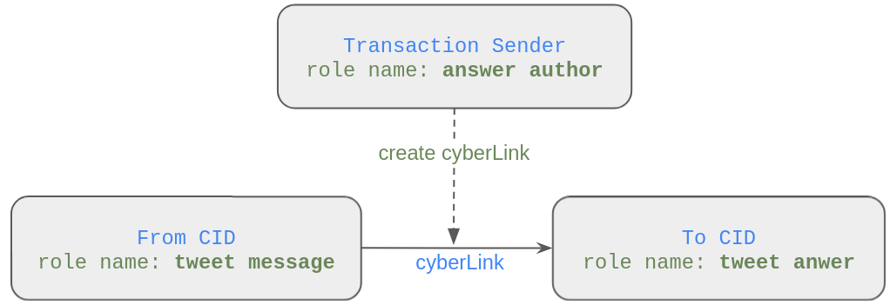
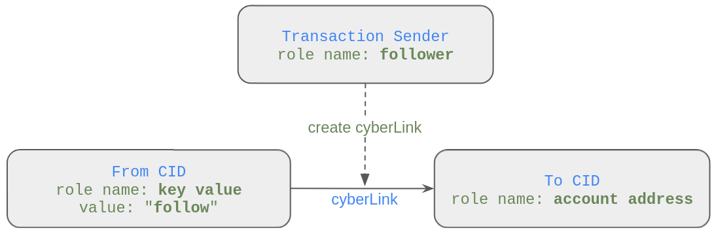
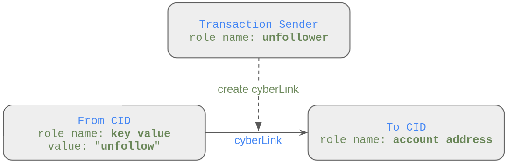
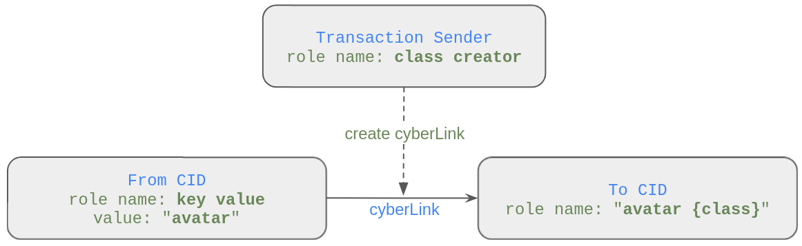
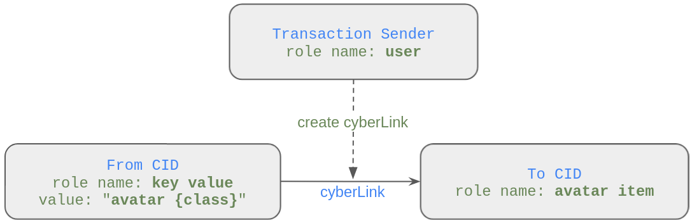
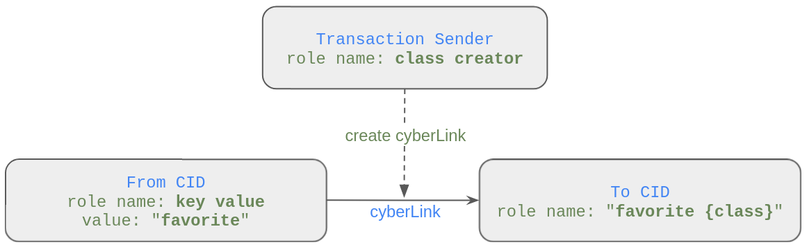
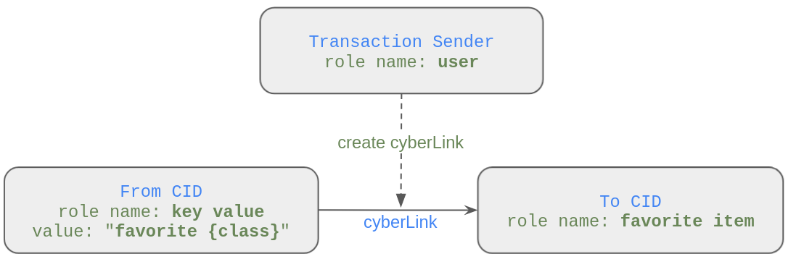
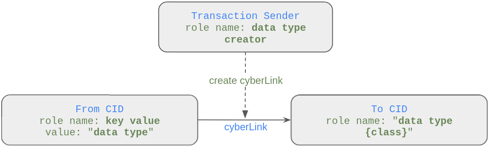
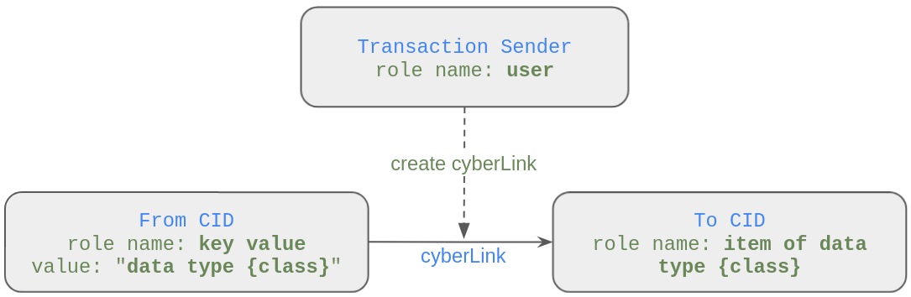

# Cyber Semantic Conventions
Semantic conventions allow you to describe data structures recorded in the cyber knowledge graph for use in one or 
more applications.

## [Proposed Cyber Semantic Convention Standards](semantic-convention-standards.md)

## Tweet
### Constants
IPFS address (CID) of the `tweet` string: `QmbdH2WBamyKLPE5zu4mJ9v49qvY8BFfoumoVPMR5V4Rvx` 
### cyberLinks
Tweet object is cyberLink:
- CID of the `tweet` string -> CID of a message  

Transaction sender is author of a tweet.

- [example cyberLink of Tweet object](https://rebyc.cyber.page/network/bostrom/tx/45DC76417B8BFC1149B6E1FD74313269A3EAFBEE53EF3097DCF02C8F88469CAA)  
- [inserting Tweet object into Cyber by the Tweet Semantic Convention](write_object_into_cyber_by_semantic_convention.ipynb)  

## Tweet Answer (current convention)
### Constants
None
### cyberLinks
Tweet Answer is cyberLink:
- CID of a tweet message -> CID of an answer message  

Transaction sender is author of an answer message.

  
## Tweet Answer (proposed convention)
It is suggested to add an additional link to recognize answer to a tweet.
### Constants
CID of the `tweet answer` string: `QmXxCVgN8WZi6QtF8x8u1pQsvVgLpi81pgjjwtHt1kQ8Ax`
### cyberLinks
Tweet Answer object is two cyberLinks:
- CID of a tweet message -> CID of an answer message
- CID of the `tweet answer` string -> CID of an answer message

Transaction sender is author of an answer message.

.png)

## Follow
### Constants
CID of the `follow` string: `QmPLSA5oPqYxgc8F7EwrM8WS9vKrr1zPoDniSRFh8HSrxx`
### cyberLinks
Follow object is cyberLink:
- CID of the `follow` string -> CID of a cyber account address

Transaction sender is a subscriber.

## Unfollow
### Constants
CID of the `unfollow` string: `QmRsRWy8K9Sb5bsHDzTUD1mtXjk5rgtXM2xi4dqmN529kM`
### cyberLinks
Unfollow object is cyberLink:
- CID of the `unfollow` string -> CID of a cyber account address

Transaction sender is an unsubscribed subscriber.

## Avatar 
### Constants
CID of the `avatar` string: `Qmf89bXkJH9jw4uaLkHmZkxQ51qGKfUPtAMxA8rTwBrmTs`  
CID of the `avatar pic` string: `QmSWnQSqwmovA8o3xPuhfD4HEg19JYzQuoStrp8xFXWU2x`  
CID of the `avatar name` string: `QmbteQvDFdMLS7Uf24F7j4rAZNSqinT74yygUhNWr2RaC2`  
CID of the `avatar account` string: `QmS1pivhZ9NPpA7CoyF7ZpuvK5RCLafBq9FtpnquoBmx18`  
### cyberLinks
Avatar class is cyberLinks:
- CID of `avatar` string -> CID of `avatar {class}` string  

The `pic`, `name` and `account` avatar classes have been set as constants, and you can skip creating them.

Avatar object is cyberLink:
- CID of `avatar {class}` string -> CID of a pic, name or account

  
## Favorites
### Constants
CID of the `favorite` string: `QmRU8Tz93jmiHEJcTz7GbmuJ6N3DxS8jzqDAp2c9UAK4mR`  
CID of the `favorite name` string: `QmbWLFqpQo1fUPnTsM4jP9aipugMXNAKSDovQLVNV4a4ai`  
CID of the `favorite label` string: `QmQuN7KtLjYGX4m4gon73Pitm8942hkwD1usQYAFghH5d5`  
CID of the `favorite tag` string: `QmcYCv1bpzTmxcfkkxUv8bBW23UCBgVMkVkPCeZ2Q5kJnb` 
### cyberLinks
Favorite class is cyberLink:
- CID of the `favorite` -> CID of `favorite {name|label|tag}`  

The `name`, `label` and `tag` favorite classes have been set as constants, and you can skip creating them.

Favorite object is a cyberLink:
- CID of `favorite {class}` -> CID of an object

## Data type 
### Constants
CID of the `data type` string: `QmRU8Tz93jmiHEJcTz7GbmuJ6N3DxS8jzqDAp2c9UAK4mR`
### cyberLinks
Initialize of a data type: 
- CID of the `data type` -> CID of a data type

  
Link object with a data type:
- CID of a data type -> CID of an object

## Price verified 
- CID of a token contract address -> CID of a price source

## Token data
- CID of a token contract address -> CID of a metadata