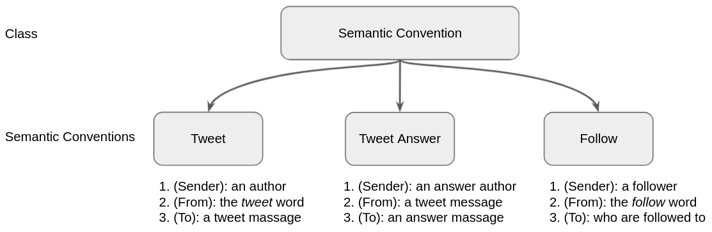
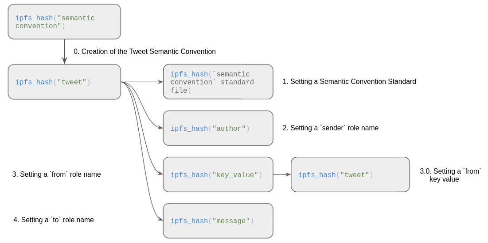
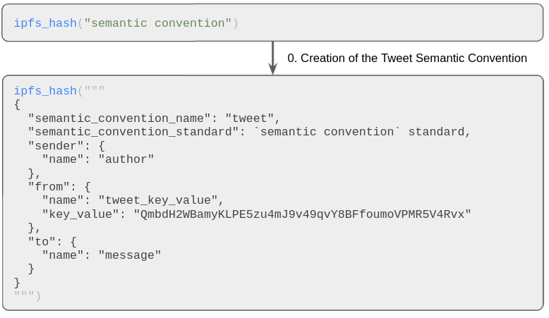

# Cyber Semantic Conventions
Semantic conventions allow you to describe data structures recorded in the cyber knowledge graph for use in one or 
more applications.

## Cyber Semantic Convention Standards
### Semantic Convention Object
  
[example for a Tweet Object](#tweet-object)
### cyberLinks Definition

Definition of a Semantic Convention by a multi-cyberLink transaction
```python
ipfs_hash("semantic convention") -> ipfs_hash(`semantic convention` name) # `semantic convention` name
ipfs_hash(`semantic convention` name) -> ipfs_hash(`semantic convention` standard) # `semantic convention` standard
ipfs_hash(`semantic convention` name) -> ipfs_hash(`sender` role name)    # `sender` role name
ipfs_hash(`semantic convention` name) -> ipfs_hash(`from` role name)      # `from` role name
ipfs_hash(`from` role name) -> ipfs_hash(`from` key value)                # `from` key value (optional)
ipfs_hash(`semantic convention` name) -> ipfs_hash(`to` role name)        # `to` role name
ipfs_hash(`to` role name) ->  ipfs_hash(`to` key value)                   # `to` key value (optional)
# definition for more than one cyberLink (optional)
[
ipfs_hash(`semantic convention` name) -> ipfs_hash(`from_[n]` role name)  # `from_[n]` role name
ipfs_hash(`from_[n]` role name) -> ipfs_hash(`from_[n]` key value)        # `from_[n]` key value (optional)
ipfs_hash(`semantic convention` name) -> ipfs_hash(`to_[n]` role name)    # `to_[n]` role name
ipfs_hash(`to_[n]` role name)  ->  ipfs_hash(`to_[n]` key value)          # `to_[n]` key value (optional)
] 
```
  
[example for the Tweet Semantic Convention](#tweet)

### JSON Definition
Definition of the Tweet Semantic Convention by a cyberLink and JSON
##### cyberLInk
```python
ipfs_hash("semantic convention") -> # `semantic convention` class
ipfs_hash(JSON)                     # `semantic convention` json
```
##### JSON
```json
{
  "semantic_convention_name": `semantic convention` name,
  "semantic_convention_standard": `semantic convention` standard,
  "sender": {
    "name": `sender` name
  },
  "from": {
    "name": `from` name,
    "key_value": `from` key value
  },
  "to": {
    "name": `to` name,
    "key_value": `to` key value
  },
  # definition for more than one cyberLink (optional)
  [,  "from_[n]": {
    "name": `from_[n]` name,
    "key_value": `from_[n]` key value
    },
    "to_[n]": {
    "name": `to_[n]` name,
    "key_value": `to_[n]` key value
  }]        
}
```
  
[example for the Tweet Semantic Convention](#tweet)

## Constants
IPFS address of the `semantic convention`: `QmbCq4d3CdvSSx9NHPrVM9WxA9uj36CE5RyzY18gxfrXxS`  
IPFS address of the `tweet` word: `QmbdH2WBamyKLPE5zu4mJ9v49qvY8BFfoumoVPMR5V4Rvx`  
IPFS address of the `follow` word: `QmPLSA5oPqYxgc8F7EwrM8WS9vKrr1zPoDniSRFh8HSrxx`

## Tweet
### Tweet Object
cyberLink from the IPFS address of `tweet` word to an IPFS address of a message.  
Transaction sender is author of a tweet.   
[Example of Tweet object transaction](https://rebyc.cyber.page/network/bostrom/tx/45DC76417B8BFC1149B6E1FD74313269A3EAFBEE53EF3097DCF02C8F88469CAA)

### cyberLinks Definition
Definition of the Tweet Semantic Convention by a multi-cyberLink [transaction](https://rebyc.cyber.page/network/bostrom/tx/A97A7621EFC07C0038FA5B1A9BA328FC3CCF1A5775141256855E4285A061BB27)
```python
ipfs_hash("semantic convention") -> ipfs_hash("tweet")          # `semantic convention` name
ipfs_hash("tweet") -> ipfs_hash(`semantic convention` standard) # `semantic convention` standard
ipfs_hash("tweet") -> ipfs_hash("author")                       # `sender` role name
ipfs_hash("tweet") -> ipfs_hash("key_value")                    # `from` role name
ipfs_hash("key_value") -> ipfs_hash("tweet")                    # `from` key value
ipfs_hash("tweet") -> ipfs_hash("message")                      # `to` role name
```
  
### JSON Definition
Definition of the Tweet Semantic Convention by a cyberLink and JSON ([Transaction](https://rebyc.cyber.page/network/bostrom/tx/3EE04317DE0AFEDAA826CC24A6062BC89339B9CF7F780E33ADC04E8A823F8EEE))
##### cyberLInk
```python
ipfs_hash("semantic convention") -> # `semantic convention` class
ipfs_hash(JSON)                     # `semantic convention` json
```
##### JSON
```json
{
  "semantic_convention_name": "tweet",
  "semantic_convention_standard": `semantic convention` standard,
  "sender": {
    "name": "author"
  },
  "from": {
    "name": "tweet_key_value",
    "key_value": "QmbdH2WBamyKLPE5zu4mJ9v49qvY8BFfoumoVPMR5V4Rvx"
  },
  "to": {
    "name": "message"
  }
}
```
   
## Tweet Answer
cyberLink from a IPFS tweet message address to an IPFS address of an answer message.  
Transaction sender is author of an answer message.

## Follow
cyberLink from the IPFS address of `follow` word to an IPFS address of a cyber account address.  
Transaction sender is a subscriber.